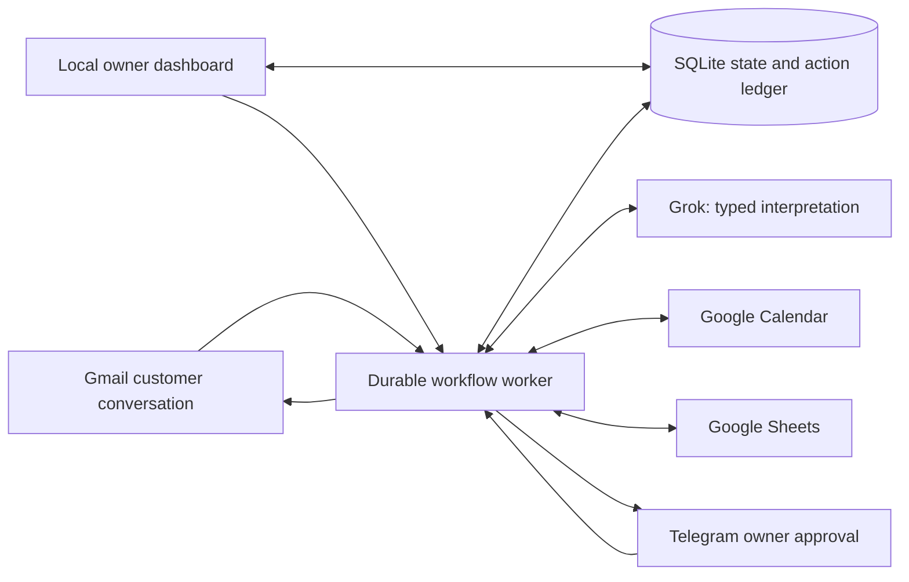
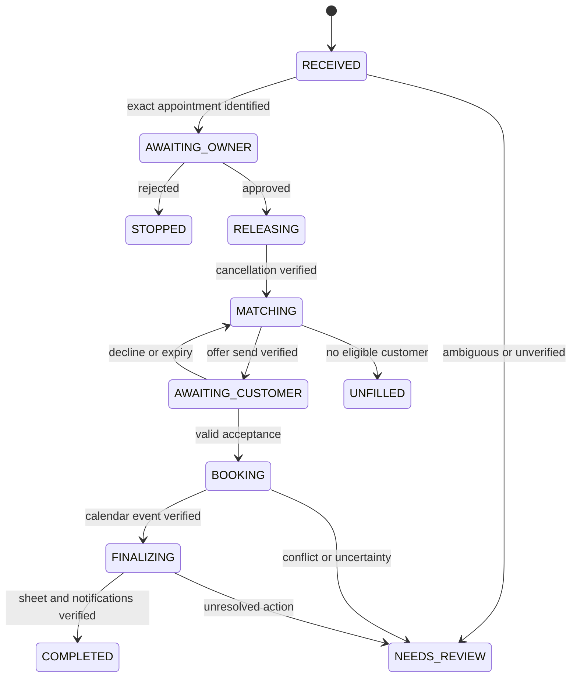

# Architecture and data

## System layout

The worker owns execution. Grok receives limited evidence and returns a proposed interpretation through the xAI SDK; it does not receive app API tokens or execute arbitrary tools. A local dashboard is an operator surface, not an external integration.

## Sources of truth

| Information | Authority |
| --- | --- |
| Actual appointment and availability | Google Calendar, freshly read before booking |
| Service catalogue and waiting-list preferences | Google Sheets, validated and snapshotted per decision |
| Customer acceptance | Gmail message identity and explicit reply to the offer |
| Owner authority | Configured Telegram identity and recorded approval |
| Workflow progress, offers, retries, deduplication | SQLite |

Sheets is not a lock manager. The model's text is not evidence that an external action happened.

## State machine

Any active state can enter PAUSED or NEEDS_REVIEW. Save resume_state for a permitted continuation. A state transition records the input event, policy decision, and timestamp in the same database transaction. COMPLETE requires all required finalization flags, not just an event creation response.

## Execution sequence

1. Poll messages with an overlap window and deduplicate by provider message ID. Store received events before advancing the polling checkpoint.
2. Extract intent, requested date, and source evidence. Validate identity and locate the existing booking by known customer email and exact event, not by name alone.
3. Record an owner approval request tied to the cancellation event and proposed scope.
4. On approval, re-read the event. If changed, ask for renewed approval. Persist cancellation intent, execute once, and verify the event is cancelled.
5. Compute eligible customers and save the selected record snapshot. Generate an offer with explicit terms and a unique offer ID.
6. Persist outbound message intent before sending; reconcile uncertain sends as described in the integration guide.
7. For each reply, verify sender, conversation, active offer, deadline, and unqualified acceptance. Changed terms require a new offer or review.
8. Under the single-worker claim, re-read the customer row and calendar. If the interval is occupied, stop without promising a booking.
9. Persist a deterministic event ID before creating the replacement appointment. Use a valid lowercase hexadecimal hash prefix, which lies within Calendar's permitted ID alphabet; never regenerate it on retry.
10. Read the created event back and compare attendee, start/end, timezone, and workflow marker.
11. Write the waiting-list row by stable customer ID; verify it. Send the customer confirmation, then the owner outcome, verifying each independently.
12. Mark COMPLETED only when all mandatory effects have evidence.

Google documents using a client-supplied event ID to help prevent duplicate creation following a failed response. This solves retry identity, not booking conflicts. See [sources](08-sources.md).

## Minimal data model

| Table | Key fields and constraints |
| --- | --- |
| incoming_events | provider, external_id, received_at, processed_at; UNIQUE(provider, external_id) |
| workflows | id, original_event_id, customer_id, state, resume_state, opening_start/end, timezone, approved_by, approved_at, replacement_event_id, version |
| offers | id, workflow_id, customer_id, terms_json, expires_at, status, gmail_thread_id, accepted_message_id; at most one active offer per workflow |
| actions | id, workflow_id, operation_key UNIQUE, provider, kind, request_fingerprint, status, attempts, external_id, next_attempt_at, error_code |
| evidence | id, action_id, checked_at, external_reference, expected_json, observed_json; redact message bodies |
| checkpoints | provider PRIMARY KEY, cursor_or_offset, updated_at |
| evaluations | run_id, scenario_id, mode, model_id, result, assertions_json, elapsed_ms, created_at |

Action states: PENDING, IN_FLIGHT, VERIFIED, RETRYABLE, UNKNOWN, NEEDS_REVIEW. On restart, reconcile IN_FLIGHT actions before retrying. Use explicit SQLite transactions and unique constraints; keep network requests outside database transactions.

## Waiting-list workbook

Two tabs with immutable IDs:

- Services: service_id, name, duration_minutes, cleanup_minutes, price_minor, currency, stylist_id.
- Waitlist: customer_id, name, email, service_id, stylist_id, available_start, available_end, timezone, joined_at, opted_in, status, booking_event_id, last_offer_id.

Store timestamps in ISO 8601 with offsets. Store canonical instants in UTC internally and render in BUSINESS_TIMEZONE. Reject malformed rows and report the specific missing value. Re-find the row by customer_id before writing because sorting can change row numbers. Do not overwrite unrelated columns.

## Model contracts

Cancellation interpretation: intent enum, referenced date/time, ambiguity reasons, and evidence excerpts from the supplied message.

Reply interpretation: ACCEPT, DECLINE, CHANGE_REQUEST, or UNCLEAR; requested changes and evidence. The application validates sender and offer context separately.

Match explanation: candidate IDs from the supplied eligible set plus a short factual explanation. The model cannot introduce new customers, change ranking, prices, or service duration.

Bound model calls, validate output, allow one repair attempt for invalid schema, then request review. Customer messages are untrusted data: instructions embedded in them cannot change authorization, app targets, or policy. Compose final confirmations from verified structured facts.

## Proposed endpoints

- GET /: dashboard.
- GET /api/workflows and GET /api/workflows/{id}: read-only progress and evidence.
- POST /api/workflows/{id}/pause: authenticated owner control.
- POST /api/workflows/{id}/resume: explicit resolution or retry of an identified step.
- GET /health: process and storage status; never expose tokens.

Telegram approval is the primary write-authorization path. Any dashboard mutation must enforce equivalent owner authorization and CSRF protection. Bind to localhost by default. Do not put an unauthenticated control dashboard on the internet.

## Limits of consistency

Calendar, email, Sheets, and Telegram are not one transaction. A booking can be valid while a spreadsheet update is pending. Preserve valid completed effects and finish the remaining steps; do not automatically cancel a customer's booking because a notification failed.

Calendar does not provide a general atomic "reserve only if free" operation. A fresh availability check plus one worker reduces risk but cannot eliminate a simultaneous manual booking. Demo with a dedicated calendar and no competing writers. Add a post-write conflict check; if a concurrent conflict is detected, mark NEEDS_REVIEW and withhold success confirmation. Production needs stronger scheduling ownership and reconciliation.
